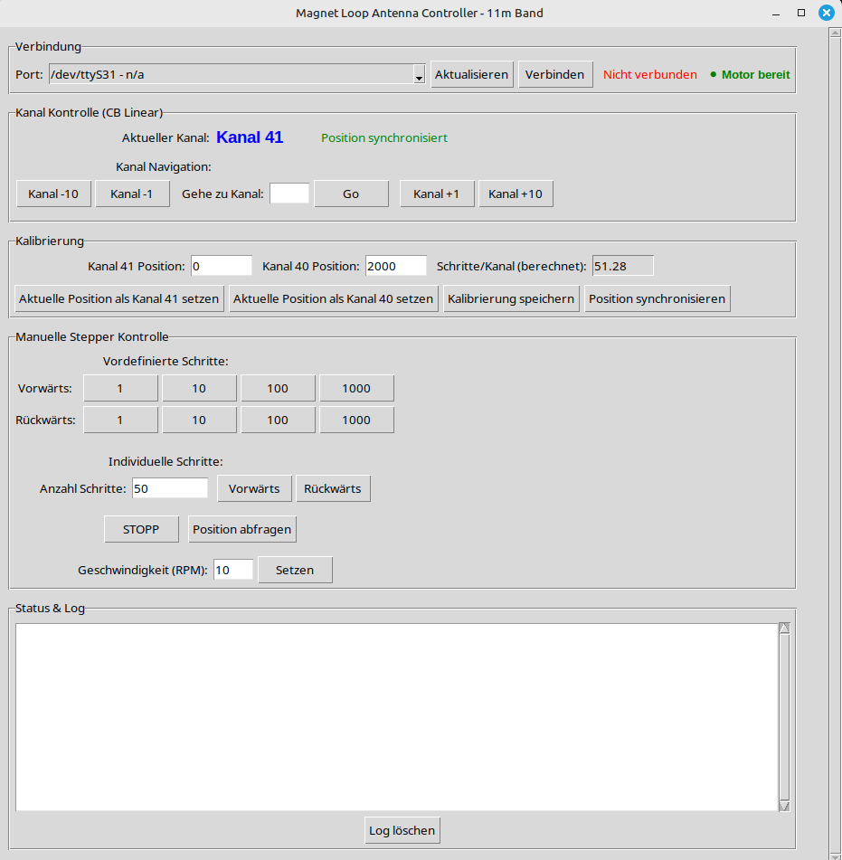

# Magnet Loop Antenna Controller



Steuerung für Schrittmotor einer Magnet Loop Antenne für das 11m Band mit 80 Kanälen.

## Übersicht

Dieses Projekt steuert einen 28BYJ-48 Schrittmotor über einen ULN2003 Treiber mit einem Arduino Uno R4 WiFi. Der Motor bewegt den Drehkondensator einer Magnet Loop Antenne für präzise Abstimmung auf verschiedene Kanäle.

## Hardware

- **Arduino**: Uno R4 WiFi
- **Stepper Motor**: 28BYJ-48 (5V)
- **Treiber**: ULN2003
- **Anwendung**: Magnet Loop Antenne 11m Band (80 Kanäle)

## Features

### Arduino Firmware
- Serielle Befehlssteuerung
- Nicht-blockierende Bewegungen
- Positionsverfolgung
- Variable Geschwindigkeit (RPM)
- Sofortiger Stopp

### Python GUI
- Intuitive Benutzeroberfläche
- Vordefinierte Schritte (1, 10, 100, 1000)
- Individuelle Schrittanzahl
- Port-Verwaltung
- Echtzeitprotokoll

## Schnellstart

### 1. Arduino-Code hochladen
```bash
pio run --target upload
```

### 2. GUI einrichten und starten
```bash
cd gui
./setup.sh
python3 magnet_loop_controller.py
```

## Anschlüsse

```
Arduino Uno R4 WiFi    ULN2003 Treiber
Pin 8           →      IN1
Pin 9           →      IN2
Pin 10          →      IN3
Pin 11          →      IN4
GND             →      GND
5V              →      VCC
```

## Serielle Befehle

- `F<steps>` - Vorwärts (z.B. `F100`)
- `B<steps>` - Rückwärts (z.B. `B50`)
- `S` - Stopp
- `P` - Position abfragen
- `RPM<value>` - Geschwindigkeit setzen (z.B. `RPM15`)

## Dokumentation

Ausführliche Dokumentation siehe [gui/README.md](gui/README.md)